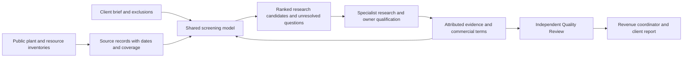

# National energy opportunity sourcing

The service researches potential energy supply and deployment locations across the United States for hosting operators, mining companies and independent miners. It includes all supported generation families and supply arrangements. No catalog represents every available opportunity, and inclusion is not an offer of power. The client pays for an agreed research and qualification deliverable; scope and fee are agreed separately.

## Requirements and assumptions

- United States defaults to all 50 states plus DC, with client-selected states and exclusions. US territories require explicit selection; other countries remain outside this national matching workflow.
- Accept landfill and flare gas, hydro, nuclear, wind, solar, geothermal, natural gas, biomass/biogas, waste-to-energy, coal, oil, marine and recovered energy. Grid supply and industrial surplus describe procurement opportunities. Hybrid and storage arrangements require their constituent generation or charging supply to be understood.
- Separate a client's desired allocation from total plant capacity. A 1 MW buyer may investigate a much larger plant. A large nameplate is not evidence of a small uncommitted allocation.
- Accept electricity or fuel-development requirements, firm/interruptible/seasonal operation, location exclusions, desired MW, cost limits, site-capital budget, readiness, term and timing. Free-text needs remain visible for specialist review; they are not silently marked satisfied.
- Preserve original site, contact, task and evidence IDs. National sourcing adds a client-fit assessment; it does not overwrite existing prospect economics, owner history or other service workflows.

## Data flow

## Implementation boundaries

`tools/build-facility-index.js` ingests EIA inventory and generation records. Its national default must retain large plants, include inventory even when generation history is missing, and disclose snapshot dates. Optional plant-size filters must be explicit metadata. Retired equipment remains distinct from current operable units. Lack of generation history is unknown, not zero output.

`source-facility.js` preserves the established `grid_facility` adapter identity while carrying technology/fuel classifications. Existing procurement and prospecting records therefore retain their identity. Public observations do not populate confirmed sale capacity, rates, condition or use rights.

`energy-opportunity-matching.js` is the shared browser/CommonJS screening model. CRM owns client brief persistence and recorded site evidence. The model is pure: it does not send outreach, write records, call an AI model, create a schedule or spend money. Client and private evidence remain in the existing CRM storage/account boundary, never in public static example files.

The public energy-service form captures the broad brief. Its current submission prepares an email draft; opening it is not delivery or a paid engagement. The client scouting preview retains its four dated landfill examples and marks broader criteria as requiring new research. Discovery inventory is not a newly delivered client report.

## Screening and ranking

1. Apply known geography, source and exact site exclusions. Explain each exclusion and preserve the underlying source.
2. Compare the client's requirements with attributed evidence. Missing values become questions, not zero cost, full uptime or available power.
3. Separate nameplate, actual generation, estimated fuel potential and an owner-offered allocation. Capacity factor is not uptime or curtailment. A low market price is not a delivered customer tariff.
4. Compare like-for-like energy-only and all-in delivered rates. Track site construction, connection, deposits and client capital separately from mining hardware. Do not infer free reuse from a photograph or equipment register.
5. Rank qualified-for-review offers by comparable delivered cost, then client site capital, then screening priority. Unresolved candidates follow by research priority, with known comparable cost breaking ties and unknown costs never treated as zero. Show reasons, missing evidence and disqualifiers. The score is neither a probability nor an investment return. A confirmed expensive mismatch does not become attractive because it has more evidence.
6. Require current, attributed owner evidence for a qualified-for-review result. This status still does not mean contracted or secured. Expired evidence falls back to confirmation work.

Evidence values use a value, confirmation attribution, actual as-of date, optional expiry and original source/reference. Quantities additionally carry explicit scope and units: offered electrical MW or verified fuel electrical equivalent; USD cents/kWh energy-only or delivered all-in; USD client site-capital scope. Owner confirmation is entered from real evidence, never generated from a public inventory or a model response. Record denials, committed output and infeasible connections as well as positive findings.

Commercial evidence must apply to the current client arrangement: the CRM binds it to the exact normalized brief, or the evidence carries matching brief/version or quoted allocation bounds. Changing clients or criteria requires reconfirmation and retains previous evidence in history. Evidence expires after 90 days or its earlier stated expiry. Written notes and additional requirements remain unresolved in the shared matcher until separately reviewed; a numeric pass cannot silently satisfy them.

## Agent responsibilities

Use the existing team identities and coordinator rather than creating one new bot per technology. Assign bounded work queues by source family and client brief version.

| Responsibility | Required result |
| --- | --- |
| Intelligence | Dated candidate discovery, physical-site deduplication, source coverage, geographic/source fit and reasons to investigate |
| Supply partnerships | Current owner and energy rights holder, public contact route, incumbent commitments, willingness, proposed allocation and supply arrangement |
| Economics and diligence | Comparable delivered energy cost, interruption/seasonality implications, connection scope, remaining capital and explicit assumptions |
| Outreach preparation | Client-specific, evidence-grounded questions and drafts through existing authorization and transport controls |
| Independent Quality Review | Reopen material sources, verify arithmetic/units and exact client fit, identify unsupported claims and review the current result version |
| Revenue coordinator | One linked client brief, assignments, record writing, corrections, approved client deliverable and actual commercial progress |

Technology-specific checks differ. Hydro needs seasonal output and water/operating constraints; nuclear needs the authorized commercial supply and delivery route; gas needs measured quantity, composition, treatment, generation and rights; wind/solar need an hourly supply profile and interruption assumptions; storage needs charging availability, cost, losses and discharge limits. All need a usable connection and owner willingness.

Keep existing agent limits, review dependencies, account separation, mailbox readiness and sending authority. A new source family does not authorize a new vendor subscription, more recipients, commitments, deployments by an agent or a recurring timer. Do not mark a cloud bot updated merely because a local prompt template changed; record the actual native handoff separately.

## Verification and future work

The September 2026 inventory refresh contains 14,327 facilities across all 50 states and DC using EIA-860 2025 and generation reported through June 2026. It includes 56 primarily nuclear facilities, 1,393 hydro facilities, 3,753 plants above the former 50 MW ceiling and 218 operable plants without generation history. These counts describe inventory, not willing sellers. EIA coverage is not a complete list of sub-1 MW or private industrial opportunities. Existing permit records retain their August 5, 2026 scope; new facility permits remain unknown until refreshed. Grid distances retain the source layer's April 30, 2018 date.

Test invalid/blank numeric limits, exact exclusions, multi-source plants, stale/contradictory evidence, energy-only versus delivered prices, generation versus available MW, unknown-country records, storage charging, plant sizes above the requested allocation, and public-only candidates. Exercise the client brief, saved evidence, ranked output and task packet together.

Refresh public inventories on their actual release cadence, retaining observation dates. Add market prices, documented curtailment, utility tariffs, procurement notices and owner-provided interval profiles through attributed evidence; no single national feed establishes sale availability. Revisit indexing, background processing and portfolio contact deduplication if the national catalog becomes too slow in-browser. Technical design, permitting and binding supply agreements remain later qualification stages.
